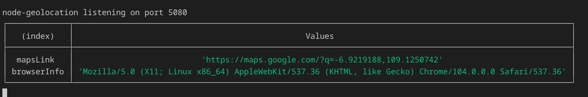

### Installation
1. Clone this repo
```
git clone https://github.com/radendi/node-geolocation.git
```
2. Install requirement packages.
```
npm install
```
3. Run app
```
npm run app
```
4. Seduce target to access this url at `http://ip:port`
5. Target location and browser info will appear in the console.
